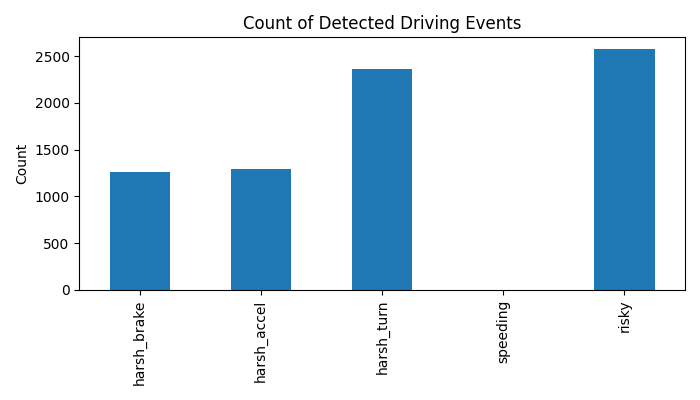
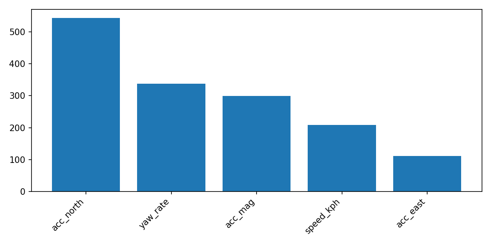
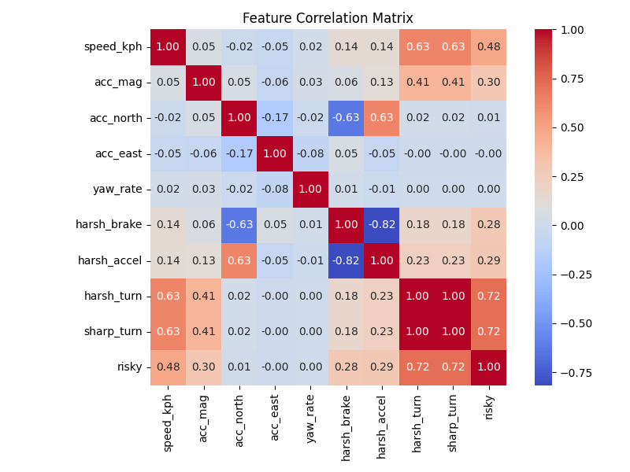
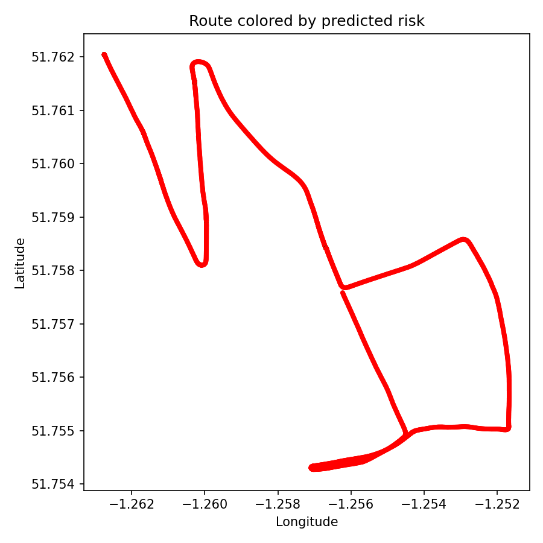
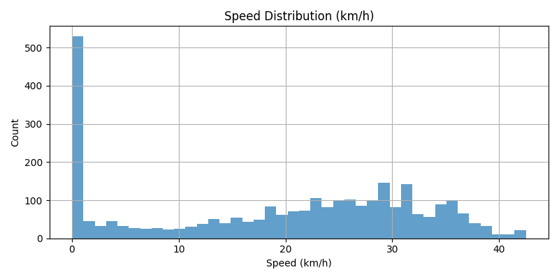
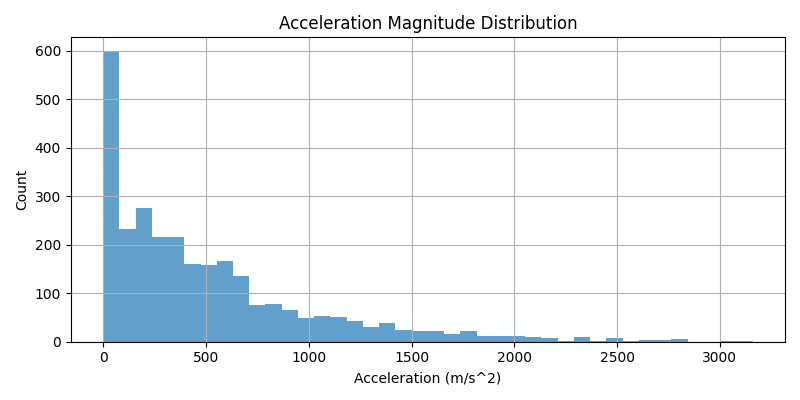

# Driving Behaviour Intelligence: Telematics Feature Engineering & Risk Modelling

**Author:** Augustine Osaigbevo

---

## Table of Contents

* [Project Description](#project-description)
* [Repository Structure](#repository-structure)
* [Instructions (How to Run)](#instructions-how-to-run)
* [Technical Approach](#technical-approach)
* [Results & Performance](#results--performance)
* [Challenges & Mitigations](#challenges--mitigations)
* [Next Steps](#next-steps)
* [Credits](#credits)

---

## Project Description

This project demonstrates the end-to-end development of **telematics-based driving behaviour analytics** and **risk classification** using real-world vehicle sensor data.
Leveraging open Oxford RobotCar INS and GPS datasets, it delivers robust feature engineering, event detection, risk modelling with machine learning (LightGBM), and insightful visual analytics—providing a blueprint for modern, data-driven motor insurance and behaviour-based risk assessment.

### Relevance:

* Behaviour-based insurance requires meaningful, explainable risk signals from real-world sensor data.
* Accurate detection of risky driving events (e.g., harsh braking, sharp turns) is key for fairer pricing, safer roads, and improved underwriting.
* The full, production-quality workflow is suitable for demonstration in a professional portfolio or integration into telematics products.

---

## Repository Structure

```
data/
  ├─ raw/                             # Original Oxford dataset after download/unzipping
  ├─ processed/                       # Pre-processed, feature-engineered datasets (CSV)
output/
  ├─ driving_events_counts.png        # Bar chart of detected events
  ├─ feature_importance.png           # LightGBM feature importance plot
  ├─ feature_correlation_matrix.png   # Feature correlation heatmap
  ├─ risk_map.png                     # Route visualisation coloured by risk
  ├─ speed_distribution.png           # Speed distribution histogram
  ├─ acc_mag_distribution.png         # Acceleration magnitude histogram
src/
  ├─ data_downloader.py               # Data download & auto-traversal detection
  ├─ data_preprocessing.py            # Robust sensor loading, timestamp parsing, cleaning
  ├─ feature_engineering.py           # Telematics feature extraction from INS/GPS
  ├─ sensor_fusion.py                 # Heading, sharp turn, and fusion features
  ├─ model.py                         # LightGBM classifier, parameter tuning, saving
  ├─ utils.py                         # Plots: feature importances, route, etc.
notebooks/
  ├─ 01_exploration.ipynb             # Data download, inspection, loading
  ├─ 02_feature_engineering.ipynb     # Feature creation, EDA, event analysis
  ├─ 03_model_training.ipynb          # ML training, hyperparameter tuning
  ├─ 04_inference_reporting.ipynb     # Inference, visualisation, export
requirements.txt                      # Python dependencies
```

---

## Instructions (How to Run)

### 1. Install dependencies

```python
%pip install -r requirements.txt
```

### 2. Download and Prepare Data

Run the first notebook (`01_exploration.ipynb`) to:

* Automatically download and extract the Oxford RobotCar INS/GPS dataset.
* Detect traversal directory and load relevant sensor files (`gps.csv`, `ins.csv`).

### 3. Feature Engineering & Event Detection

Run `02_feature_engineering.ipynb`:

* Computes telematics features (speed, acceleration, yaw rate, etc.).
* Detects events such as harsh braking, acceleration, and sharp turns.
* Produces exploratory visualisations (event counts, feature distributions).

### 4. Train the Risk Model

Run `03_model_training.ipynb`:

* Trains a LightGBM classifier to predict “risky” segments based on engineered features.
* Hyperparameter tuning (GridSearchCV) for robust results.
* Saves model and feature importance plot.

### 5. Inference & Reporting

Run `04_inference_reporting.ipynb`:

* Predicts risk on the full dataset.
* Visualises the driving route coloured by predicted risk.
* Outputs all key plots and analyses to the `output/` directory.

---

## Technical Approach

### 1. Sensor Data Loading

* Robust loaders for GPS and INS files (handles Oxford’s native formats).
* INS position, velocity, and orientation are the primary signal source; GPS is used for validation and mapping.

### 2. Feature Engineering ([src/feature\_engineering.py](src/feature_engineering.py))

* **Speed:** Horizontal speed from velocity components.
* **Acceleration:** Derived by differentiating INS velocities.
* **Yaw rate:** Change in heading (from INS yaw) per unit time.
* **Event detection:** Threshold-based labelling for harsh braking, acceleration, and sharp turning.
* **Risk label:** “Risky” flag generated from event occurrence.

### 3. Sensor Fusion ([src/sensor\_fusion.py](src/sensor_fusion.py))

* Computes heading and heading change from yaw.
* Sharp turn detection based on heading dynamics.

### 4. Machine Learning ([src/model.py](src/model.py))

* **Model:** LightGBM classifier with balanced class weights and grid hyperparameter search.
* **Features:** Only non-derived/raw features (no leakage from event labels into model features).
* **Evaluation:** Stratified train/test split; classification metrics reported.

### 5. Visual Analytics ([src/utils.py](src/utils.py))

* **Event counts:** Bar charts of driving events.
* **Feature importance:** LightGBM feature importances.
* **Correlation matrix:** Heatmap of key engineered features.
* **Route mapping:** Colour-coded risk overlays on the real route.

---

## Results & Performance

### Sample Outputs

| Step                | Example Output                                        |
| ------------------- | ----------------------------------------------------- |
| Event counts        |      |
| Feature importances |           |
| Correlation matrix  |  |
| Route risk map      |                       |
| Speed distribution  |                |
| Accel. distribution |                |

### Model Training

* Model hyperparameters selected via grid search:
  `{'learning_rate': 0.05, 'max_depth': 4, 'n_estimators': 80, 'num_leaves': 7}`
* **Feature importance** ranks acceleration, yaw rate, and speed as primary predictors.

### Performance

* Classification metrics reflect model accuracy based on raw telematics features only.
* Visualisations provide insights into both feature relevance and real-world event distributions.
* Route visualisation highlights high-risk and low-risk segments for interpretability.

---

## Challenges & Mitigations

| Challenge                       | Approach/Mitigation                                                  |
| ------------------------------- | -------------------------------------------------------------------- |
| **Label leakage risk**          | No event-derived columns (harsh\_brake, etc.) used as ML features.   |
| **Non-standard sensor formats** | Loader functions robust to Oxford’s unique CSV headers.              |
| **Small labelled sample**       | Used all available data; design allows easy extension to new data.   |
| **Class imbalance**             | Model uses class weighting; clear reporting of risk class support.   |
| **Urban/stop-start traffic**    | Speed/acceleration thresholds selected for robustness in UK driving. |

---

## Next Steps

* Incorporate additional traversals for larger training data and stronger generalisation.
* Integrate map-based features (e.g., road type, weather, speed limits).
* Deploy risk scoring as a real-time or batch analytics service (Databricks, cloud, etc.).
* Benchmark against other models (e.g., XGBoost, neural networks).
* Conduct feature ablation and SHAP analysis for deeper explainability.

---

## Credits

* [Oxford RobotCar Dataset](https://robotcar-dataset.robots.ox.ac.uk/)
* [LightGBM](https://lightgbm.readthedocs.io/)

---

*Contact: [augustine.osaigbevo@gmail.com](mailto:augustine.osaigbevo@gmail.com)*